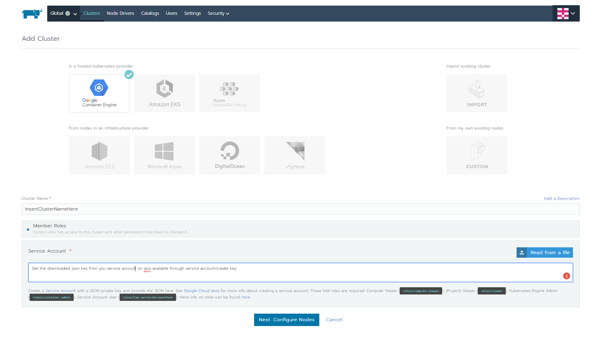
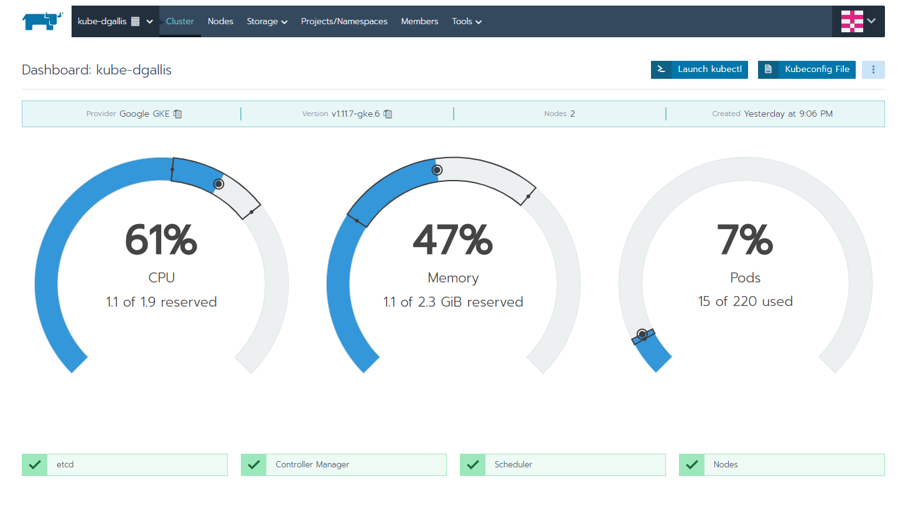
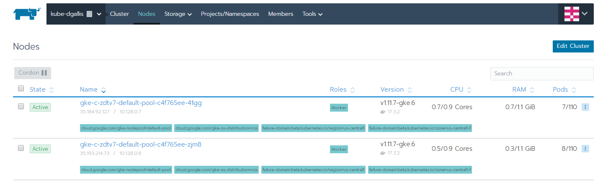

# Cloud-Auditing-Framework-GCP-
Building a custom auditing framework through Docker utilizing google cloud services[GKS], kubernetes management service[Rancher], and an auditing tool[Security Monkey]

•	Introduction
With the rise in cloud technologies utilized in the Idustry today, hosting services on the cloud is becoming an industry best standard centered around efficiency and availability. 
Utilizing docker containers we have to ability to expose specific external network points, allowing for external traffic into ports we decide. With this docker has the ability 
to increase the overall security of our services. Docker defined "Namespaces" provide the first and most straightforward form of isolation: processes running within a 
container cannot see, and even less affect, processes running in another container, or in the host system. Next, Each container also gets its own network stack, meaning 
that a container doesn’t get privileged access to the sockets or interfaces of another container.

In combination with Kubernetes docker becomes somewhat complex due to network level access issues, but through all that, it makes running containers extrememely 
simple and easy to manage. For the management side of kuberenetes I have chosen to use an open source service called Rancher. Rancher was built to manage Kubernetes everywhere it runs. 
It can easily deploy new clusters from scratch, launch EKS, GKE and AKS clusters, or even import existing Kubernetes clusters. 

For my blog my goal is to implement a local rancher server instance, connect kubernetes clusters from Google Cloud Platform, and Implement security monkey to audit existing gcp infastructure.

•	Hypothesis
In my opinion I believe this model will be versitile with multiple cloud enviroments, even if you do not prefer to use gcp. Security Monkey by Netflix has the ability to audit multiple AWS,GCP, and even Github accounts in unions. Utilizing the capabilites of GCP compute engine and GKS we can establish a highly scalable outocome with a capibility of growing as the size of cloud infastructure increases. For example, with my project which utilizes GKS and Security Monkey intially I most likely will start with one scheduler to keep track of around 10 workers which perform task neccsarry to audit my gcp services. For an enterprise level company, this is utilized at a much larger scale with often multiple schedulers working with clusters of workers that all eventually push out information to a master scheduler. So for the current state of the industry I believe this is vital to allow companies the ability to properly audit their cloud services and reduce their overall risk of intrusion!

•	Research Sources:
https://rancher.com/docs/rancher/v2.x/en/
"Rancher adds significant value on top of Kubernetes, first by centralizing role-based access control (RBAC) for all of the clusters and giving global admins the ability to control cluster access from one location. It then enables detailed monitoring and alerting for clusters and their resources, ships logs to external providers, and integrates directly with Helm via the Application Catalog. If you have an external CI/CD system, you can plug it into Rancher, but if you don’t, Rancher even includes a pipeline engine to help you automatically deploy and upgrade workloads."

https://docs.docker.com/
Documentation used for the installation/creation of docker containers

https://kubernetes.io/docs/home/
Documentation used as reference for the creation of clusters and integration with gcp and security monkey

https://cloud.google.com/docs/
Documentation used when setting up services on/through GCP - compute engine resources/services accounts for access/etc.

•	Steps to reproduce

# Installing Docker (local machine):
=====================

### Script only works if sudo caches the password for a few minutes:

`sudo true`

`sudo apt-get update`

### Alternatively you can use the official docker install script

`wget -qO- https://get.docker.com/ | sh`

### Install docker-compose

``COMPOSE_VERSION=`git ls-remote https://github.com/docker/compose | grep refs/tags | grep -oP "[0-9]+\.[0-9][0-9]+\.[0-9]+$" | tail -n 1``

``sudo sh -c "curl -L https://github.com/docker/compose/releases/download/${COMPOSE_VERSION}/docker-compose-`uname -s`-`uname -m` > /usr/local/bin/docker-compose"``

`sudo chmod +x /usr/local/bin/docker-compose`

`sudo sh -c "curl -L https://raw.githubusercontent.com/docker/compose/${COMPOSE_VERSION}/contrib/completion/bash/docker-compose > /etc/bash_completion.d/docker-compose"]`

### Install docker-cleanup command (good for cleaning up your messy docker listings)

`cd /tmp`

`git clone https://gist.github.com/76b450a0c986e576e98b.git`

`cd 76b450a0c986e576e98b`

`sudo mv docker-cleanup /usr/local/bin/docker-cleanup`

`sudo chmod +x /usr/local/bin/docker-cleanup`

---

# Setting up Rancher 2.0 (local machine):
=====================

1. Provision a single Linux host:
All hosts must be provisioned according to Rancher's [Requirements](https://rancher.com/docs/rancher/v2.x/en/installation/requirements/) to launch your Rancher Server.

2. Running rancher/rancher and rancher/rancher-agent on the Same Node:

- In the situation where you want to use a single node to run Rancher and to be able to add the same node to a cluster, you have to adjust the host ports mapped for the rancher/rancher container.

- If a node is added to a cluster, it deploys the nginx ingress controller which will use port 80 and 443. This will conflict with the default ports we advice to expose for the rancher/rancher container.

- Please note that this setup is not recommended for production use, but can be convenient for development/demo purposes.

- To change the host ports mapping, replace the following part `-p 80:80 -p 443:443` with `-p 8080:80 -p 8443:443:`

3. To start the server and agent run this command on your locally hosted machine:

    `docker run -d --restart=unless-stopped -p 8080:80 -p 8443:443 rancher/rancher:latest`

- This spins up the Rancher Server container, which also acts as the master node in your default Kubernetes cluster. You can also use Rancher Server to manage an existing Kubernetes cluster on other services such the IBM Cloud Container Service as well.

---

# Linking Google GKS to Rancher 2.0:
=====================

1. Once the container has is started issue command `sudo docker ps` to check what external port your container was set push out from.

2. Then navigate to http://hostmachine:insertporthere and you’ll be presented with the initial interface of Rancher's Dashboard.

3. You will then be prompted to insert your default password to login to the web interface with and then with:

4. After that you will then be asked to specify your access URL for all rancher related services (make sure the ip is publicy accessable from GCP)

5. Once everything is set up you will then need to create your cluster by going to "global" and hitting tab "create cluster" on you rancher UI. You will then be taken to a page displaying options for linking clusters

6. After inserting basic related information to create a cluster through GKS you will then use a simliar config before submitting the cluster to provision.

7. Next you should then see the following cluster being created and the proper nodes displayed in workloads

### Troubleshooting:

Your rancher server is behind the public network so the GKS or EKS's callback cannot connect to your rancher server successfully, you will need to add a proxy to expose your rancher server and make sure the proxy IP and port and configured properly within the rancher settings `https://your-rancher-server-url/g/settings/advanced`.

Note: if you check your Google GKS the newly added k8s cluster should already be there, remember to remove it if you have created in previous!

---

# Installing Security Monkey through GCP [Netflix Docs](https://github.com/Netflix/security_monkey/tree/develop/docs)
=====================

### Install gcloud

If you haven't already, install *gcloud* from the [downloads](https://cloud.google.com/sdk/downloads) page.  *gcloud* enables you to administer VMs, IAM policies, services and more from the command line.

### Setup Service Account

To restrict which permissions Security Monkey has to your projects, we'll create a [Service Account](https://cloud.google.com/compute/docs/access/service-accounts) with a special role.

- Access the [Google console](https://console.cloud.google.com/home/dashboard).
- Under "IAM & Admin", select "Service accounts."
- Select "Create Service Account".
  - Name: "securitymonkey"
  - Add Role "IAM->SecurityReviewer"
  - Add Role "Project->Viewer"
  - **NOTE**: If you're going to monitor your GCP services from an external system (i.e. an AWS instance), check the box "Furnish a new private key" and ensure JSON is selected as the Key type. The filesystem path to this JSON is what is supplied to the `creds_file` parameter when creating a GCP account.
    - If you are going to be monitoring your GCP services from a GCP instance, then you don't need to generate a key. You will instead launch your GCP instance with this service account.
  - Hit "Create"

 - Select the newly created "securitymonkey" services account and click on "Permissions".
   -  Type in your Google email adddress and select the Owner role.
   -  Press "Add".

### Enable IAM API

For each GCP project you would like Security Monkey to access, you'll need to enable the IAM API.  Visit the [IAM API page](https://console.cloud.google.com/apis/api/iam.googleapis.com/overview) page in the web console
 and click 'Enable API' at the top of the screen. When dealing with many projects, you might prefer to do this with the gcloud command.  For details on how to enable services with gcloud, visit the
  [service-management](https://cloud.google.com/service-management/enable-disable#enabling_services) page.  The IAM service name is 'iam.googleapis.com'.

### Creating Security Monkey instance on GCP (Ubuntu 16.04)

Create an instance running Ubuntu 16.04 LTS using our 'securitymonkey' service account.

Navigate to the [Create Instance page](https://console.developers.google.com/compute/instancesAdd). Fill in the following fields:

-   **Name**: securitymonkey
-   **Zone**: If using GCP Cloud SQL, select the same zone here. [(Zone List)](https://cloud.google.com/compute/docs/regions-zones/regions-zones#available)
-   **Machine Type**: 1vCPU, 3.75GB (minimum; also known as n1-standard-1)
-   **Boot Disk**: Ubuntu 16.04 LTS
-   **Service Account**: securitymonkey (This is provisioned in the [IAM GCP instructions](https://github.com/Netflix/security_monkey/blob/develop/docs/iam_gcp.md).)
-   **Firewall**: Allow HTTPS Traffic

Click the *Create* button to create the instance.

Install gcloud
--------------

If you haven't already, install *gcloud* from the [downloads](https://cloud.google.com/sdk/downloads) page. *gcloud* enables you to administer VMs, IAM policies, services and more from the command line.

Connecting to your new instance:
--------------------------------

We will connect to the new instance over ssh with the gcloud command:

    $ gcloud compute ssh securitymonkey --zone <ZONE>

Or by initalizing a gloud shell through the gcp suite.

### Postgres on GCP

If you are deploying Security Monkey on GCP and decide to use Cloud SQL, it's recommended to run [Cloud SQL Proxy](https://cloud.google.com/sql/docs/postgres/sql-proxy) to connect to Postgres. To use Postgres on Cloud SQL, create a new instance from your GCP console and create a password for the `postgres` user when Cloud SQL prompts you. (If you ever need to reset the `postgres` user's password, refer to the [Cloud SQL documentation](https://cloud.google.com/sql/docs/postgres/create-manage-users).)

Enable Cloud SQL API
--------------------
To use cloud_sql_proxy you will need to enable the Google Cloud SQL API. Visit the [Cloud SQL API page](https://console.cloud.google.com/apis/api/sqladmin.googleapis.com/overview) and click 'Enable API'.

Create a service account for Cloud SQL Proxy
--------------------------------------------
To be able to run the Cloud SQL Proxy you will need to create a [Service Account](https://cloud.google.com/compute/docs/access/service-accounts) with a special role.

- Access the [Google console](https://console.cloud.google.com/home/dashboard).
- Under "IAM & Admin", select "Service accounts."
- Select "Create Service Account".
  - Name: "cloud-sql-proxy"
  - Add Role "Cloud SQL-> Cloud SQL Client"
- Select "Furnish a new private key"
  - Key type: JSON
- Click "Save"

After the instance is up, run Cloud SQL Proxy:

    $ ./cloud_sql_proxy -instances=[INSTANCE CONNECTION NAME]=tcp:5432 -credential_file=/path/to/gcp/serviceaccount/keys/key.json &

You can find the instance connection name by clicking on your Cloud SQL instance name on the [Cloud SQL dashboard](https://console.cloud.google.com/sql/instances) and looking under "Properties". The instance connection name is something like [PROJECT\_ID]:[REGION]:[INSTANCENAME].

You'll need to run Cloud SQL Proxy on whichever machine is accessing Postgres, e.g. on your local workstation as well as on the GCE instance where you're running Security Monkey.

Connect to the Postgres instance:

    $ sudo psql -h 127.0.0.1 -p 5432 -U postgres -W

# Setting up and Linking Accounts to Audit
=====================

### Configure the Application

Security Monkey ships with a config for this quickstart guide called config.py. You can override this behavior by setting the `SECURITY_MONKEY_SETTINGS` environment variable.

Modify `env-config/config.py`:
- `FQDN`: Add the IP or DNS entry of your instance.
- `SQLALCHEMY_DATABASE_URI`: This config assumes that you are using the local db option. If you setup AWS RDS or GCP Cloud SQL as your database, you will need to modify the SQLALCHEMY_DATABASE_URI to point to your DB.
- `SECRET_KEY`: Something random.
- `SECURITY_PASSWORD_SALT`: Something random.

For an explanation of the configuration options, see [options](../options.md).

### Create the database tables:

Security Monkey uses Flask-Migrate (Alembic) to keep database tables up to date. To create the tables, run this command:

    cd /usr/local/src/security_monkey/
    monkey db upgrade

### Add Your AWS/GCP Accounts

You'll need to add at least one account before starting the scheduler. It's easiest to add them from the command line, but it can also be done through the web UI. :

    monkey add_account_aws
    usage: monkey add_account_aws [-h] -n NAME [--thirdparty] [--active]
                                  [--notes NOTES] --id IDENTIFIER
                                  [--update-existing]
                                  [--canonical_id CANONICAL_ID]
                                  [--s3_name S3_NAME] [--role_name ROLE_NAME]

    monkey add_account_gcp
    usage: monkey add_account_gcp [-h] -n NAME [--thirdparty] [--active]
                                  [--notes NOTES] --id IDENTIFIER
                                  [--update-existing] [--creds_file CREDS_FILE]

    monkey add_account_openstack
    usage: monkey add_account_openstack [-h] -n NAME [--thirdparty] [--active]
                                  [--notes NOTES] --id IDENTIFIER
                                  [--update-existing]
                                  [--cloudsyaml_file CLOUDSYAML_FILE]

For clarity: the `-n NAME` refers to the name that you want Security Monkey to use to associate with the account.
A common example would be "test" for your testing AWS account or "prod" for your main production AWS account. These names are unique.
Note that `--role_name` defaults to "SecurityMonkey", if you are using a different role, this value is just the role name, not the ARN.

The `--id IDENTIFIER` is the back-end cloud service identifier for a given provider. For AWS, it's the 12 digit account number, 
and for GCP, it's the project ID. For OpenStack, it's the cloud configuration to load from the clouds.yaml file.

# Setup Nginx for Security Monkey:
=====================

Security Monkey uses gunicorn to serve up content on its internal 127.0.0.1 address. For better performance, and to offload the work of serving static files, we wrap gunicorn with nginx. Nginx listens on 0.0.0.0 and proxies some connections to gunicorn for processing and serves up static files quickly.

### securitymonkey.conf

Copy the config file into place:

    sudo cp /usr/local/src/security_monkey/nginx/security_monkey.conf /etc/nginx/sites-available/security_monkey.conf
    sudo ln -s /etc/nginx/sites-available/security_monkey.conf /etc/nginx/sites-enabled/security_monkey.conf
    sudo rm /etc/nginx/sites-enabled/default
    sudo service nginx restart
    
### Start the API server

Manually start Security Monkey with `monkey run_api_server`. For autostarting your security monkey instance follow the [Netflix Documentation](https://github.com/Netflix/security_monkey/blob/develop/docs/autostarting.md)

### Manually Loading Data into Security Monkey
--------------------------------
To initially get data into Security Monkey, you can run the `monkey find_changes` command. This will go through
all your configured accounts in Security Monkey, fetch details about the accounts, store them into the database,
and then audit the items for any issues. 

The `find_changes` command can be further scoped to account and technology with the `-a account` and `-m technology` parameters.