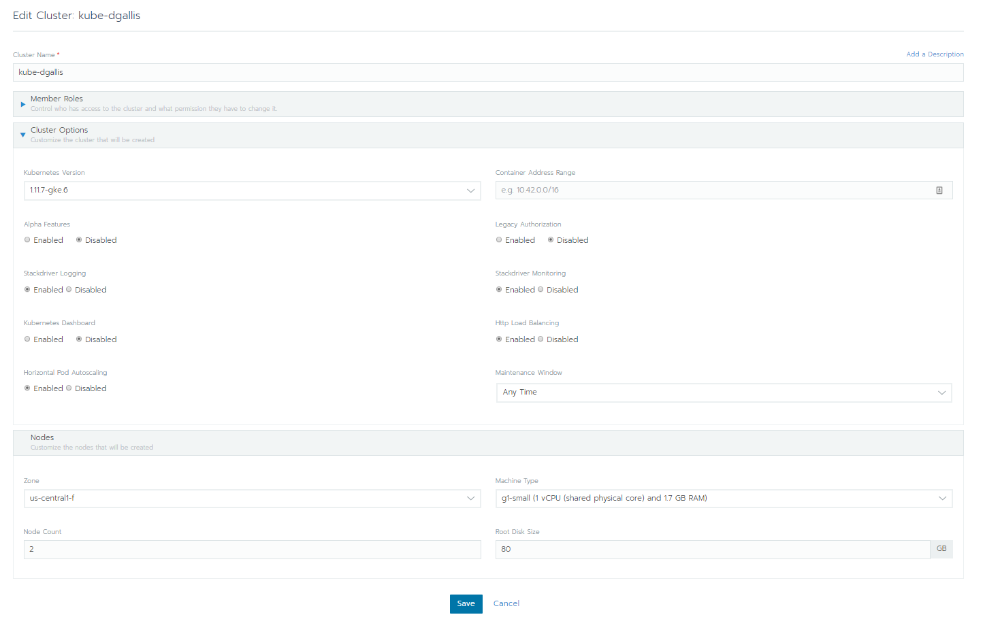

## Linking Google GKS to Rancher 2.0:
=====================

1. Once the container has is started issue command `sudo docker ps` to check what external port your container was set push out from.

2. Then navigate to http://hostmachine:insertporthere and you’ll be presented with the initial interface of Rancher's Dashboard.

3. You will then be prompted to insert your default password to login to the web interface with and then with:

4. After that you will then be asked to specify your access URL for all rancher related services (make sure the ip is publicy accessable from GCP)

5. Once everything is set up you will then need to create your cluster by going to "global" and hitting tab "create cluster" on you rancher UI. You will then be taken to a page displaying options for linking clusters

6. After inserting basic related information to create a cluster through GKS you will then use a simliar config before submitting the cluster to provision.

7. Next you should then see the following cluster being created and the proper nodes displayed in workloads

### Troubleshooting:

Your rancher server is behind the public network so the GKS or EKS's callback cannot connect to your rancher server successfully, you will need to add a proxy to expose your rancher server and make sure the proxy IP and port and configured properly within the rancher settings `https://your-rancher-server-url/g/settings/advanced`.

Note: if you check your Google GKS the newly added k8s cluster should already be there, remember to remove it if you have created in previous!

[Back to home](../README.md)

[On to the next step](rancher_setup.md)